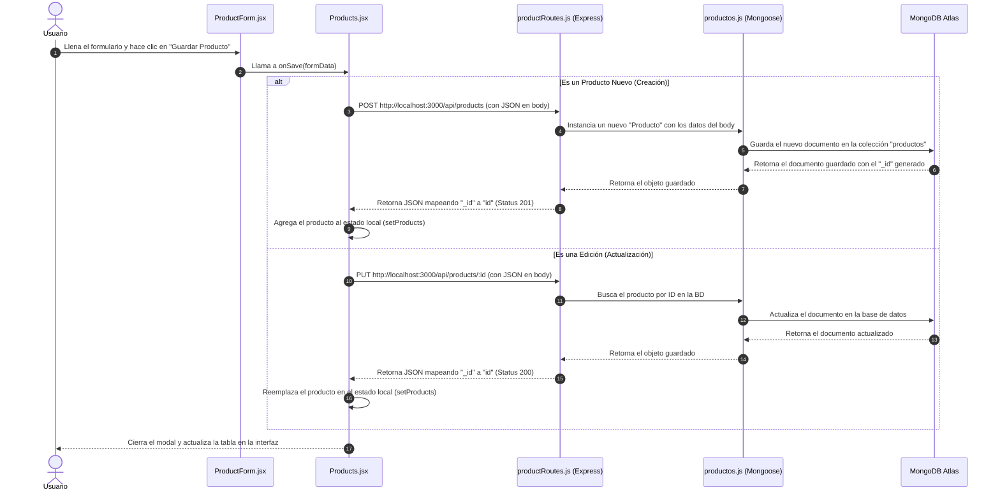

# Flujo de Creación y Edición de Productos

Este documento describe detalladamente el flujo que sigue la aplicación desde que el usuario interactúa con la interfaz en el frontend hasta que los datos quedan persistidos en la base de datos de MongoDB.

## Diagrama de Secuencia

---

## Descripción Paso a Paso del Proceso

### 1. Interacción del Usuario en el Frontend
- El usuario abre el modal de producto (ya sea haciendo clic en **"+ Agregar Producto"** o en **"✏️ Editar"**).
- Rellena o modifica los campos en el componente [ProductForm.jsx](file:///Users/fifer/Desktop/Repos/Pandaderia/panaderia/frontend/src/components/ProductForm.jsx).
- Al hacer clic en enviar, se dispara el evento `onSubmit` del formulario, ejecutando la función `handleSubmit()`, la cual invoca a `onSave(formData)` heredada desde la página principal.

### 2. Manejo en la Página de Productos
- En [Products.jsx](file:///Users/fifer/Desktop/Repos/Pandaderia/panaderia/frontend/src/pages/Products.jsx), la función `handleSaveProduct()` recibe la estructura del formulario:
  - **Creación**: Si no existe `productData.id`, hace un request tipo **`POST`** a `http://localhost:3000/api/products`.
  - **Edición**: Si existe `productData.id`, hace un request tipo **`PUT`** a `http://localhost:3000/api/products/:id`.

### 3. Recepción en el Backend (API REST)
- La petición llega al servidor Express configurado en [index.js](file:///Users/fifer/Desktop/Repos/Pandaderia/panaderia/backend/index.js) y se enruta al router [productRoutes.js](file:///Users/fifer/Desktop/Repos/Pandaderia/panaderia/backend/routes/productRoutes.js):
  - **POST `/`**: Valida y crea una nueva instancia del modelo de Mongoose.
  - **PUT `/:id`**: Busca por identificador de base de datos, mapea los nuevos datos y los sobreescribe.

### 4. Modelo de Datos y Base de Datos (Mongoose & MongoDB)
- El modelo [productos.js](file:///Users/fifer/Desktop/Repos/Pandaderia/panaderia/backend/models/productos.js) define los tipos, restricciones y validaciones (por ejemplo, que el código sea único y el stock mínimo no sea negativo).
- Mongoose interactúa con el clúster de MongoDB Atlas configurado mediante la variable `MONGODB_URI` en el archivo `.env` del backend.
- Tras completarse la operación en la BD, la ruta del backend formatea la respuesta: añade la propiedad `id` basada en `_id` para garantizar la compatibilidad con el frontend sin alterar la estructura original de este, y responde un código de estado adecuado (`201 Created` o `200 OK`).

### 5. Actualización en Pantalla
- El frontend recibe la respuesta JSON del servidor, actualiza el estado local de React (`setProducts(...)`) con el producto nuevo o editado para gatillar un renderizado automático, y cierra el modal del formulario (`setIsFormOpen(false)`).
